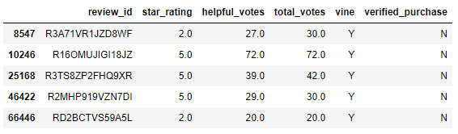
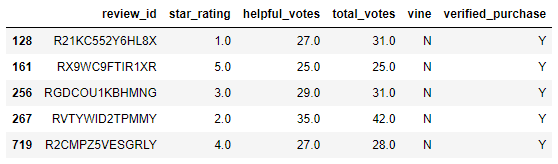

# Amazon Vine Analysis

## Overview of Analysis

### Purpose

A company is interested in enrolling in the Amazon Vine program but would like to know if it's worth the cost. The Vine program is a service in which companies pay a fee to Amazon and provide the product to Vine members, who are then required to write a review. I have chosen the Pet Products review dataset for this analysis and will be using PySpark to perform the ETL process with an AWS RDS instance. Then I will use Pandas to determine if there is bias toward favorable Vine reviews.

## Results

The review dataset was filtered for reviews where total votes was greater than or equal to 20 and the helpful votes percentage was greater than or equal to 50%. The data was further filtered to create DataFrames for Vine reviews and non-Vine reviews, as seen below.

### Vine Reviews (Paid)

- There were **170** Vine reviews.
  - `total_paid = paid_review_df["review_id"].count()`
- There were **65** 5-star Vine reviews.
  - `paid_5_star = paid_review_df[paid_review_df["star_rating"] == 5].count()["review_id"]`
- The percentage of Vine reviews that were 5 stars is **38.2%**.
  - `paid_5_star_percentage = paid_5_star / total_paid * 100`

### Non-Vine Reviews (Unpaid)

- There were **37,840** non-Vine reviews.
  - `total_unpaid = unpaid_review_df["review_id"].count()`
- There were **20,612** 5-star non-Vine reviews.
  - `unpaid_5_star = unpaid_review_df[unpaid_review_df["star_rating"] == 5].count()["review_id"]`
- The percentage of non-Vine reviews that were 5 stars is **54.5%**.
  - `unpaid_5_star_percentage = unpaid_5_star / total_unpaid * 100`

## Summary

### Vine Program Bias

Based on the results, there appears to be positivity bias for reviews in the Vine program. Looking at reviews that people considered to be helpful, only 38.2% of the Vine reviews were 5 stars whereas 54.5% of the non-Vine reviews were 5 stars. This significantly smaller percentage implies that people assume if someone is a Vine member, they might review the product more favorably and not be as honest. It's also possible that Vine members do not want to appear biased in their review, so they do not give a product 5 stars as often and may be more critical with their assessment.

### Additional Analysis

In order to support this statement, an additional analysis could be done to find the 5-star percentage of Vine and non-Vine reviews for the entire dataset, instead of the filtered dataset in this analysis. If the overall percentage of 5-star reviews for the Vine program is significantly less than non-Vine reviews, it shows that Vine members are less likely to give a product 5 stars. If the percentage is not significantly less, then it shows that people are less likely to consider a favorable Vine review helpful. Either way, this would indicate a positivity bias of some form for reviews in the Vine program.
